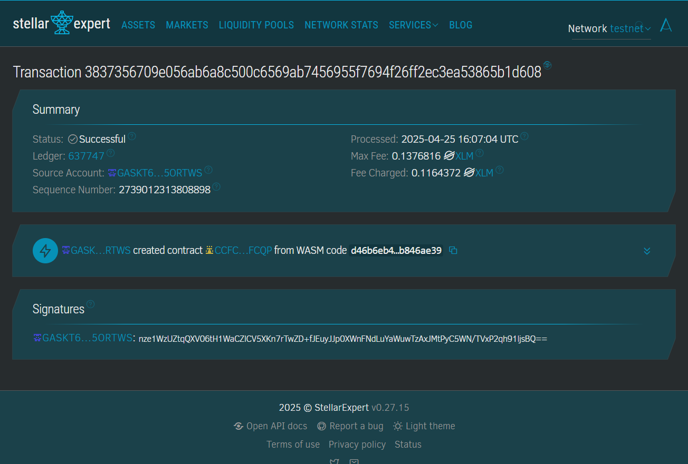
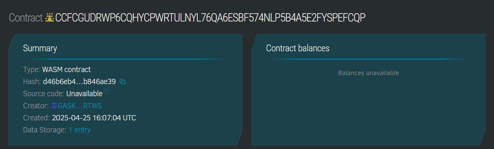
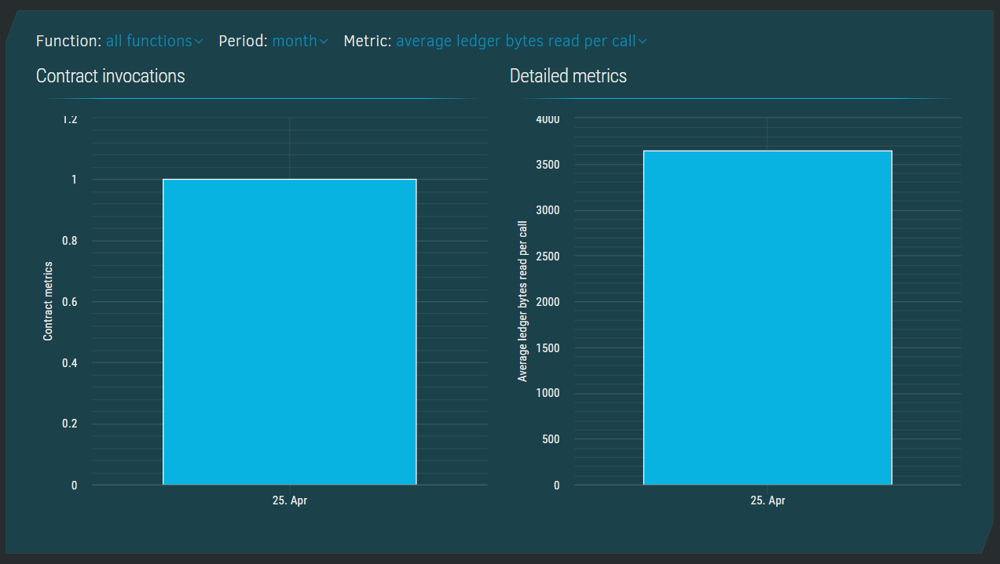
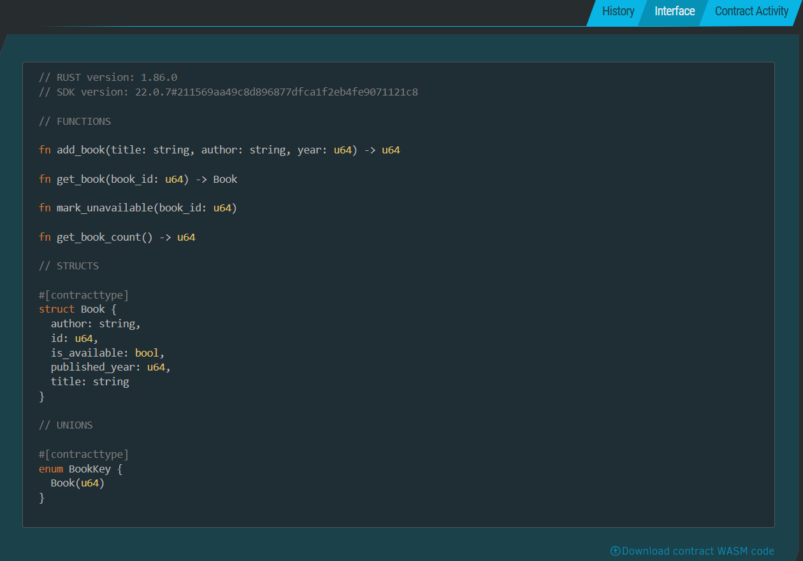

# 📚 Children Book Series

## Project Structure

```text
.
├── contracts
│   └── hello_world
│       ├── src
│       │   ├── lib.rs
│       │   └── test.rs
│       └── Cargo.toml
├── target
├── Cargo.toml
└── README.md
```

## 📖 Project Description
The **Children Book Series** smart contract is designed to manage and track a collection of children's books in a decentralized and immutable way using the Soroban smart contract platform. It ensures safe addition, retrieval, and availability management of books in a trusted and transparent manner.

---

## 🔭 Project Vision
To build a decentralized library or inventory system for children's books that supports educational institutions, NGOs, and families in maintaining a secure, verifiable, and easily accessible collection of literary content.

---

## ✨ Key Features

| Feature               | Description |
|----------------------|-------------|
| Add Book             | Add a new book with title, author, and publication year. |
| Get Book Details     | Retrieve information about a book using its unique ID. |
| Mark Book Unavailable| Update a book's status as unavailable (e.g., borrowed or damaged). |
| Total Book Count     | View the total number of books added to the series. |

---

## 🚀 Future Scope

- ✅ Support for multiple book categories (e.g., age groups, genres).
- ✅ Integration with NFT metadata to create collectible book tokens.
- ✅ Book lending and borrowing functionality.
- ✅ Tracking user interactions or book reviews using smart contracts.
- ✅ Interoperability with decentralized storage (like IPFS) for storing book covers or content.

---

## Contract Details

CCFCGUDRWP6CQHYCPWRTULNYL76QA6ESBF574NLP5B4A5E2FYSPEFCQP






